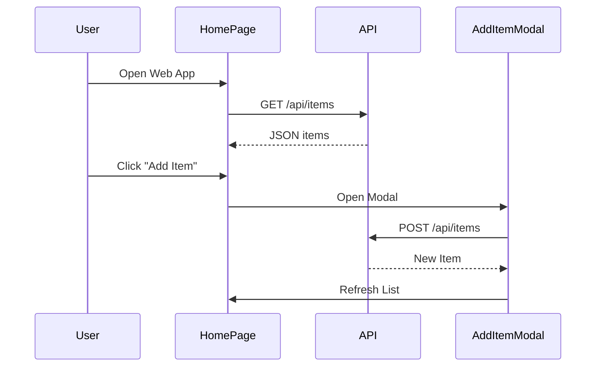
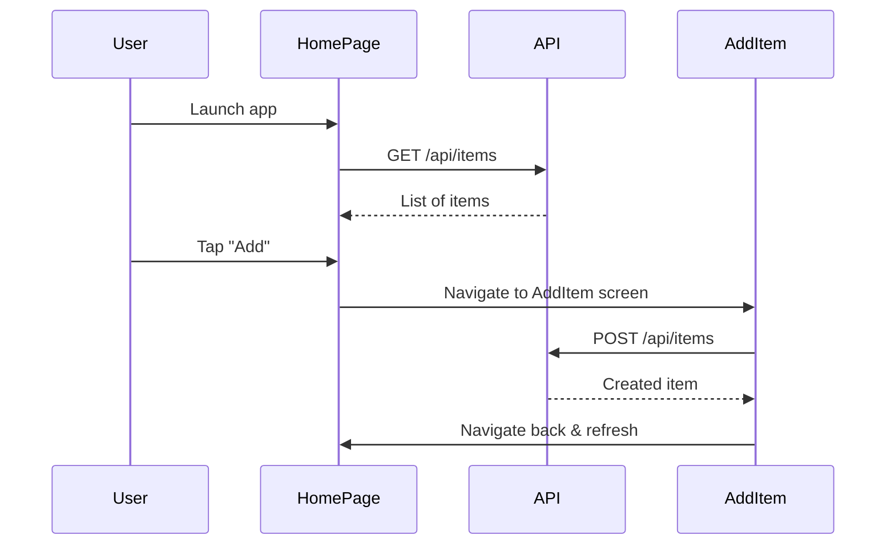
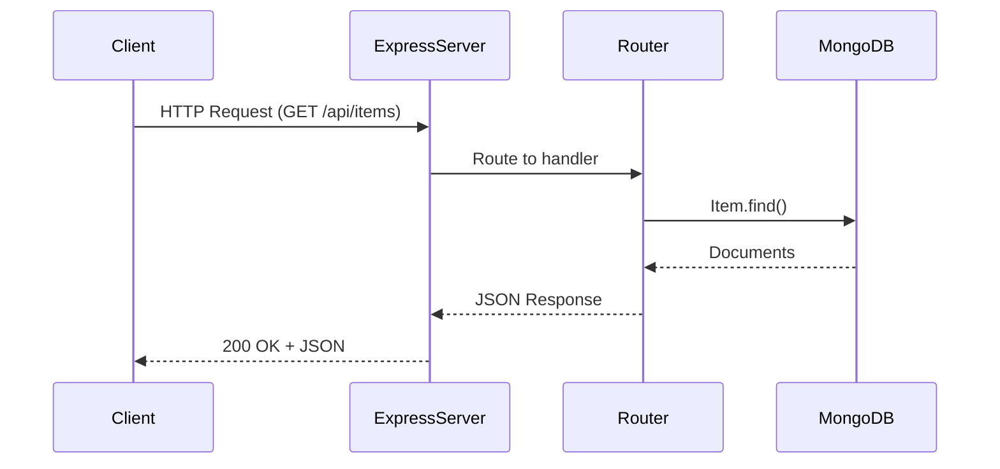

___
# Inventory Design


# Inventory App Design Document

## 1. System Architecture Overview

```plaintext
+-------------+     HTTP     +-------------+     Mongoose    +-------------+
| Vue.js Web  |  <------->   |  Express.js |  <----------->  |  MongoDB    |
| React Native|              |    API      |                 |             |
+-------------+              +-------------+                 +-------------+
        ^                         ^                                 
        | Axios                   | CORS, JSON                     
        |                         |
        +----- Shared Logic ------+
              (e.g., @shared/api)

```

## 2. Use Case Diagram

- **Actor**: User
- **Use Cases**:
    - Add Item
    - View Items
    - Edit Item
    - Delete Item

## 3. Class Diagram

### Item Model

- `Item`
  - `String name`
  - `Number quantity`
  - `String location`
  - `String description`
  - `Date createdAt`
  - `Date updatedAt`

## 4. Sequence Diagram - Add Item

```plaintext
User -> Web/Mobile App: Click "Add Item"
Web/Mobile App -> Express API: POST /api/items
Express API -> MongoDB: Save Item
MongoDB -> Express API: Item Saved
Express API -> Web/Mobile App: 201 Created + Item
```

## 5. API Documentation

### Base URL: `/api/items`

| Method | Endpoint         | Description     | Request Body                                    | Response       |
|--------|------------------|-----------------|-------------------------------------------------|----------------|
| GET    | `/api/items`     | List all items  | N/A                                             | `[Item]`       |
| POST   | `/api/items`     | Create new item | `{ name, quantity, location, description }`     | `Item`         |
| PUT    | `/api/items/:id` | Update an item  | `{ name?, quantity?, location?, description? }` | `Item`         |
| DELETE | `/api/items/:id` | Delete an item  | N/A                                             | 204 No Content |

## 6. MongoDB Schema (Mongoose)

```js
const itemSchema = new mongoose.Schema({
  name: String,
  quantity: Number,
  location: String,
  description: String,
}, { timestamps: true });
```

## 7. Component Tree

### Vue.js Web

```plaintext
App.vue
├── HomePage.vue
│   ├── ItemList.vue
│   ├── AddItemModal.vue
│   └── EditItemModal.vue
```

### React Native

```plaintext
App.js
├── HomePage.js
├── AddItem.js
└── EditItem.js
```

## 8. Navigation Flow

### Web (Vue Router)
- `/` → HomePage → List of Items
- `/edit/:id` → Edit Item

### Mobile (React Navigation)
- `HomePage` (default screen)
- `AddItem` → Add Item screen
- `EditItem` → Edit Item screen with form pre-filled

___

# Web Frontend Design


# Inventory App – Vue.js Web Frontend Design

## 1. Component Tree

```plaintext
App.vue
├── HomePage.vue
│   ├── AddItemModal.vue
│   ├── EditItemModal.vue
│   ├── ViewItemModal.vue
```

## 2. Route Structure

```plaintext
routes.js
/
├── /           → HomePage
├── /add        → AddItemModal
├── /edit/:id   → EditItemModal
```

## 3. Component Responsibilities

### App.vue
- Root layout component
- Hosts router-view

### HomePage.vue
- Fetches and displays a list of items from API
- Navigates to Add or Edit views

### AddItemModal.vue
- Modal form to create a new item
- Submits data via POST to Express API

### EditItemModal.vue
- Modal form to edit or delete an item
- Submits data via PUT or DELETE to API

### ViewItemModal.vue
- Shows item details in a read-only modal

## 4. Data Flow & API Integration

- All API calls are made using Axios via `@shared/api`
- Items are fetched on mount or navigation focus
- State is held locally in each component via `ref()` or `reactive()`

## 5. State Transitions (Mermaid Sequence)



## 6. Styling & UX

- Uses TailwindCSS for a consistent UI
- Mobile responsive layout
- Button feedback, error handling, and loading the indicators included

___

# Mobile Frontend Design


# Inventory App – React Native Mobile Frontend Design

## 1. Screen Component Tree

```plaintext
App.js
├── HomePage.js
├── AddItem.js
└── EditItem.js
```

## 2. Navigation Flow

- Stack Navigator is used for screen transitions
- Flow:
    - `HomePage` → default
    - `AddItem` → for creating a new item
    - `EditItem` → for editing or deleting an item

## 3. Component Responsibilities

### App.js
- Registers screens with the stack navigator
- Hosts the main navigation container

### HomePage.js
- Fetches and displays a list of items using Axios
- Navigates to `AddItem` and `EditItem`

### AddItem.js
- Controlled input form for creating an item
- Submits data via POST to Express API

### EditItem.js
- Editable form pre-filled with item data
- Updates or deletes the item via PUT or DELETE

## 4. Data Flow & API Integration

- Axios is used to fetch and post data to Express backend
- API helpers are imported from `@shared/api`
- Each screen manages its own local state using `useState` and `useEffect`

## 5. Sequence Diagram (Mermaid)



## 6. Styling & UX

- Styled with React Native `StyleSheet`
- Touch-friendly buttons
- Form validation and error messages included
- Designed for iOS and Android responsiveness

___

# Api Backend Design


# Inventory App – API & Backend Design

## 1. Stack Overview

- **Framework**: Express.js
- **Database**: MongoDB (via Mongoose)
- **Environment Config**: `.env` for MONGO_URI
- **CORS** enabled for cross-origin access
- **JSON** body parsing with `express.json()`

## 2. Folder Structure

```plaintext
api/
├── index.js              # Entry point, sets up Express server
├── routes/
│   └── items.js          # CRUD routes for Item model
└── models/
    └── Item.js           # Mongoose schema for Item
```

## 3. Item Schema

```js
const itemSchema = new mongoose.Schema({
  name: { type: String, required: true },
  quantity: { type: Number, required: true },
  location: { type: String },
  description: { type: String }
}, { timestamps: true });
```

## 4. API Endpoints

### Base Route: `/api/items`

| Method | Endpoint | Description      |
|--------|----------|------------------|
| GET    | `/`      | Fetch all items  |
| GET    | `/:id`   | Fetch item by ID |
| POST   | `/`      | Create new item  |
| DELETE | `/:id`   | Delete an item   |

## 5. Sequence Diagram (Mermaid)



## 6. Error Handling

- `404 Not Found`: When an item does not exist
- `400 Bad Request`: Validation errors
- `500 Internal Server Error`: DB connection or logic failure

## 7. Environment Configuration

```dotenv
MONGO_URI="your-mongodb-connection-string"
PORT=5055
```
___
