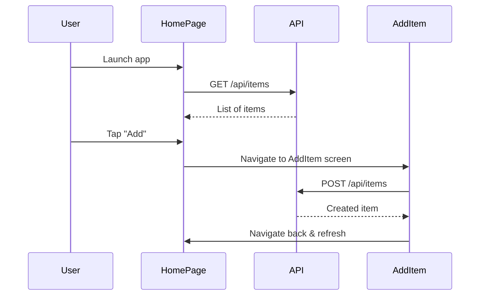

# Inventory App – React Native Mobile Frontend Design

## 1. Screen Component Tree

```plaintext
App.js
├── HomePage.js
├── AddItem.js
└── EditItem.js
```

## 2. Navigation Flow

- Stack Navigator is used for screen transitions
- Flow:
    - `HomePage` → default
    - `AddItem` → for creating a new item
    - `EditItem` → for editing or deleting an item

## 3. Component Responsibilities

### App.js
- Registers screens with the stack navigator
- Hosts the main navigation container

### HomePage.js
- Fetches and displays a list of items using Axios
- Navigates to `AddItem` and `EditItem`

### AddItem.js
- Controlled input form for creating an item
- Submits data via POST to Express API

### EditItem.js
- Editable form pre-filled with item data
- Updates or deletes the item via PUT or DELETE

## 4. Data Flow & API Integration

- Axios is used to fetch and post data to Express backend
- API helpers are imported from `@shared/api`
- Each screen manages its own local state using `useState` and `useEffect`

## 5. Sequence Diagram (Mermaid)



## 6. Styling & UX

- Styled with React Native `StyleSheet`
- Touch-friendly buttons
- Form validation and error messages included
- Designed for iOS and Android responsiveness
