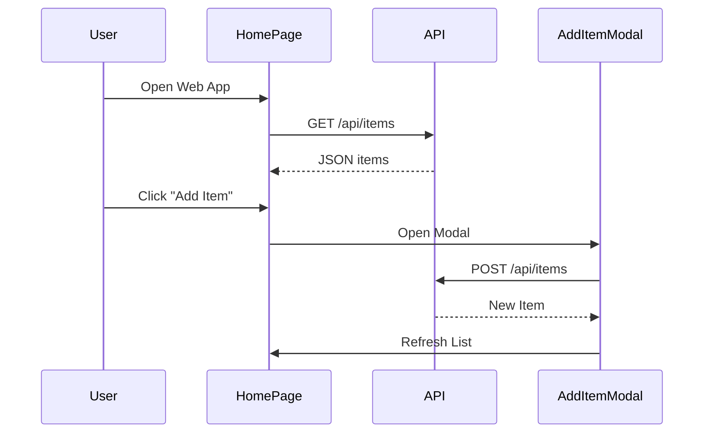

# Inventory App – Vue.js Web Frontend Design

## 1. Component Tree

```plaintext
App.vue
├── HomePage.vue
│   ├── AddItemModal.vue
│   ├── EditItemModal.vue
│   ├── ViewItemModal.vue
```

## 2. Route Structure

```plaintext
routes.js
/
├── /           → HomePage
├── /add        → AddItemModal
├── /edit/:id   → EditItemModal
```

## 3. Component Responsibilities

### App.vue
- Root layout component
- Hosts router-view

### HomePage.vue
- Fetches and displays list of items from API
- Navigates to Add or Edit views

### AddItemModal.vue
- Modal form to create a new item
- Submits data via POST to Express API

### EditItemModal.vue
- Modal form to edit or delete an item
- Submits data via PUT or DELETE to API

### ViewItemModal.vue
- Shows item details in a read-only modal

## 4. Data Flow & API Integration

- All API calls are made using Axios via `@shared/api`
- Items are fetched on mount or navigation focus
- State is held locally in each component via `ref()` or `reactive()`

## 5. State Transitions (Mermaid Sequence)



## 6. Styling & UX

- Uses TailwindCSS for consistent UI
- Mobile responsive layout
- Button feedback, error handling, and loading indicators included
